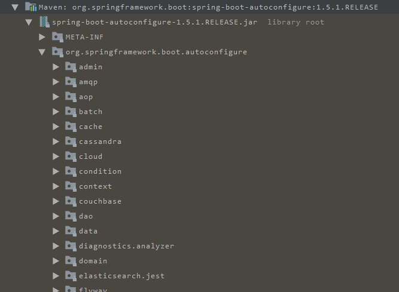

## 了解SpringBoot

### 为什么学习SpringBoot

java一直被人诟病的一点就是臃肿、麻烦。当我们还在辛苦的搭建项目时，可能Python程序员已经把功能写好了，究其原因注意是两点：

- 复杂的配置，
  项目各种配置其实是开发时的损耗， 因为在思考 Spring 特性配置和解决业务问题之间需要进行思维切换，所以写配置挤占了写应用程序逻辑的时间。
- 一个是混乱的依赖管理。
  项目的依赖管理也是件吃力不讨好的事情。决定项目里要用哪些库就已经够让人头痛的了，你还要知道这些库的哪个版本和其他库不会有冲突，这难题实在太棘手。并且，依赖管理也是一种损耗，添加依赖不是写应用程序代码。一旦选错了依赖的版本，随之而来的不兼容问题毫无疑问会是生产力杀手。

<!--more-->

### SpringBoot的特点

Spring Boot 主要目标是：

- 为所有 Spring 的开发者提供一个非常快速的、广泛接受的入门体验
- 开箱即用（启动器starter-其实就是SpringBoot提供的一个jar包），但通过自己设置参数（.properties），即可快速摆脱这种方式。
- 提供了一些大型项目中常见的非功能性特性，如内嵌服务器、安全、指标，健康检测、外部化配置等
- 绝对没有代码生成，也无需 XML 配置。

## 快速入门

### 建立Maven工程

### 添加依赖
SpringBoot提供了一个名为spring-boot-starter-parent的工程，里面已经对各种常用依赖（并非全部）的版本进行了管理，
我们的项目需要以这个项目为父工程，这样我们就不用操心依赖的版本问题了，需要什么依赖，直接引入坐标即可！

#### 添加父工程坐标
```xml
<parent>
    <groupId>org.springframework.boot</groupId>
    <artifactId>spring-boot-starter-parent</artifactId>
    <version>2.0.0.RELEASE</version>
</parent>
```
#### 添加Web启动器
为了让SpringBoot帮我们完成各种自动配置，
我们必须引入SpringBoot提供的自动配置依赖，我们称为启动器。因为我们是web项目，这里我们引入web启动器

```xml
<dependencies>
    <dependency>
        <groupId>org.springframework.boot</groupId>
        <artifactId>spring-boot-starter-web</artifactId>
    </dependency>
</dependencies>
```
### 管理JDK版本
默认情况下，maven工程的jdk版本是1.5，而我们开发使用的是1.8，因此这里我们需要修改jdk版本，只需要简单的添加以下属性即可
```xml
<properties>
    <java.version>1.8</java.version>
</properties>
```

### 启动类
```java
@SpringBootApplication
public class org.ranger.Application {
    public static void main(String[] args) {
        SpringApplication.run(org.ranger.Application.class, args);
    }
}
```

### 添加Controller
```java
@Controller
public class IndexController {
    @ResponseBody
    @RequestMapping("/hello")
    public Object hello(){
        return "hello,spring boot~!";
    }

    @ResponseBody
    @RequestMapping("/index")
    public String index(){
        return "index";
    }
}
```

## Java配置

### 回顾历史

在以前我们配置一个bean该怎么做呢？

在xml配置文件中添加标签,例如配置数据库连接池
```xml
<!-- 配置连接池 -->
<bean id="dataSource" class="com.alibaba.druid.pool.DruidDataSource"
      init-method="init" destroy-method="close">
    <property name="url" value="${jdbc.url}" />
    <property name="username" value="${jdbc.username}" />
    <property name="password" value="${jdbc.password}" />
</bean>
```

### 使用Java配置

Java配置主要是使用Java注解和类
- `@Configuration`:声明一个类作为配置类，代替xml文件
- `@Bean`:声明在方法上，根据方法的返回值加入Bean容器，代替`<bean/>`标签
- `@Value`:属性注入
- `PropertySource`:指定外部属性文件

我们使用Java配置来配置数据库连接池,首先引入连接池依赖
```xml
 <dependency>
            <groupId>com.alibaba</groupId>
            <artifactId>druid</artifactId>
            <version>1.1.9</version>
        </dependency>
```

创建配置文件类
```java
@PropertySource("jdbc.properties")
@Configuration
public class JDBCConfig {
    @Value("${jdbc.url}")
    private String url;
    @Value("${jdbc.driverClassName}")
    private String driverClassName;
    @Value("${jdbc.username}")
    private String username;
    @Value("${jdbc.password}")
    private String password;
    private String url1;

    @Bean
    public DataSource dataSource(){
        DruidDataSource dataSource = new DruidDataSource();
        dataSource.setUrl(url1);
        dataSource.setDriverClassName(driverClassName);
        dataSource.setUsername(username);
        dataSource.setPassword(password);

        return dataSource;
    }
}
```
### SpringBoot的属性注入

上面我们使用了`@Value`注解来注入属性，这种方式可行但不能注入复杂的类型

SpringBoot中提供了另外一种属性注入的方式，这种方式既可以注入基本数据类型也可注入复杂数据类型

使用`@ConfigurationProperties(prefix="jdbc")`

`application.yml`中配置相应的属性值：
```yaml
jdbc:
  url: jdbc:mysql://127.0.0.1:3306/leyou
  driverClassName: com.mysql.jdbc.Driver
  username: cyp
  password: cyp
```

```java

@ConfigurationProperties(prefix = "jdbc")
public class JDBCProperties {
    private String url;
    private String driverClassName;
    private String username;
    private String password;

    public String getUrl() {
        return url;
    }

    public void setUrl(String url) {
        this.url = url;
    }

    public String getDriverClassName() {
        return driverClassName;
    }

    public void setDriverClassName(String driverClassName) {
        this.driverClassName = driverClassName;
    }

    public String getUsername() {
        return username;
    }

    public void setUsername(String username) {
        this.username = username;
    }

    public String getPassword() {
        return password;
    }

    public void setPassword(String password) {
        this.password = password;
    }
}

```

使用：通过@EnableConfigurationProperties(JdbcProperties.class)来声明要使用JdbcProperties这个类的对象

可以使用以下方式注入`JDBCProperties对象`
- @Autowired注入
    ```java
    @Autowired
    private JdbcProperties prop;
    ```
- 构造函数注入
    ```java
    private JdbcProperties prop;
    public JdbcConfig(Jdbcproperties prop){
        this.prop = prop;
    }
    ```
- 声明有@Bean的方法参数注入
    ```java
    @Bean
    public Datasource dataSource(JdbcProperties prop){
       // TODO
    }
    ```
本例中，我们采用第三种方式。


```java
@Configuration
@EnableConfigurationProperties(JDBCProperties.class)
public class JDBCConfig {
    @Bean
    public DataSource dataSource(JDBCProperties jdbc){
        DruidDataSource dataSource = new DruidDataSource();
        dataSource.setUrl(jdbc.getUrl());
        System.out.println(jdbc.getUrl());
        dataSource.setDriverClassName(jdbc.getDriverClassName());
        dataSource.setUsername(jdbc.getUsername());
        dataSource.setPassword(jdbc.getPassword());

        return dataSource;
    }
}

```

## 自动配置原理

使用了 SpringBoot之后，以前很多繁琐的配置文件都不需要我们自己写了，这是怎么做到的呢，这一切都依赖于SpringBoot的自动配置

SpringBoot应用是从main方法开始的，main方法所在的类有一个`@SpringBootApplication`注解。

### @SpringBootApplication

查看该注解的源码
```java
@Target(ElementType.TYPE)
@Retention(RetentionPolicy.RUNTIME)
@Documented
@Inherited
@SpringBootConfiguration
@EnableAutoConfiguration
@ComponentScan(excludeFilters = {
		@Filter(type = FilterType.CUSTOM, classes = TypeExcludeFilter.class),
		@Filter(type = FilterType.CUSTOM, classes = AutoConfigurationExcludeFilter.class) })
public @interface SpringBootApplication {
```

这里重点的注解有3个：
- @SpringBootConfiguration
- @EnableAutoConfiguration
- ComponentScan

#### @SpringBootConfiguration
查看这个注解的源码
```java
@Target(ElementType.TYPE)
@Retention(RetentionPolicy.RUNTIME)
@Documented
@Configuration
public @interface SpringBootConfiguration {

}
```
通过这段我们可以看出，在这个注解上面，又有一个@Configuration注解。通过上面的注释阅读我们知道：
这个注解的作用就是声明当前类是一个配置类，然后Spring会自动扫描到添加了@Configuration的类，并且读取其中的配置信息。
而@SpringBootConfiguration是来声明当前类是SpringBoot应用的配置类，项目中只能有一个。所以一般我们无需自己添加。

#### @EnableAutoConfiguration
SpringBoot内部对大量的第三方库或Spring内部库进行了默认配置，这些配置是否生效，取决于我们是否引入了对应库所需的依赖，如果有那么默认配置就会生效。

#### @ComponentScan
```java
/**
 * Configures component scanning directives for use with @{@link Configuration} classes.
 * Provides support parallel with Spring XML's {@code <context:component-scan>} element.
 *
 * <p>Either {@link #basePackageClasses} or {@link #basePackages} (or its alias
 * {@link #value}) may be specified to define specific packages to scan. If specific
 * packages are not defined, scanning will occur from the package of the
 * class that declares this annotation.
 *
 * <p>Note that the {@code <context:component-scan>} element has an
 * {@code annotation-config} attribute; however, this annotation does not. This is because
 * in almost all cases when using {@code @ComponentScan}, default annotation config
 * processing (e.g. processing {@code @Autowired} and friends) is assumed. Furthermore,
 * when using {@link AnnotationConfigApplicationContext}, annotation config processors are
 * always registered, meaning that any attempt to disable them at the
 * {@code @ComponentScan} level would be ignored.
 *
 * <p>See {@link Configuration @Configuration}'s Javadoc for usage examples.
 *
 * @author Chris Beams
 * @author Juergen Hoeller
 * @author Sam Brannen
 * @since 3.1
 * @see Configuration
 */
@Retention(RetentionPolicy.RUNTIME)
@Target(ElementType.TYPE)
@Documented
@Repeatable(ComponentScans.class)
public @interface ComponentScan {

```

大概的意思：

> 配置组件扫描的指令。提供了类似与<context:component-scan>标签的作用
通过basePackageClasses或者basePackages属性来指定要扫描的包。如果没有指定这些属性，那么将从声明这个注解的类所在的包开始，扫描包及子包

而我们的@SpringBootApplication注解声明的类就是main函数所在的启动类，因此扫描的包是该类所在包及其子包。因此，一般启动类会放在一个比较前的包目录中。


### 默认配置原理
通过刚才的学习，我们知道@EnableAutoConfiguration会开启SpringBoot的自动配置，并且根据你引入的依赖来生效对应的默认配置。那么问题来了：

- 这些默认配置是在哪里定义的呢？
- 为何依赖引入就会触发配置呢？

其实在我们的项目中，已经引入了一个依赖：spring-boot-autoconfigure，其中定义了大量自动配置类


这里面几乎涵盖了所有的主流框架

SpringBoot为我们提供了默认配置，而默认配置生效的条件一般有两个：

- 你引入了相关依赖
- 你自己没有配置

1）启动器

所以，我们如果不想配置，只需要引入依赖即可，而依赖版本我们也不用操心，因为只要引入了SpringBoot提供的stater（启动器），就会自动管理依赖及版本了。


2）全局配置

另外，SpringBoot的默认配置，都会读取默认属性，而这些属性可以通过自定义application.properties文件来进行覆盖。这样虽然使用的还是默认配置，但是配置中的值改成了我们自定义的。

## 实践:加密数据库密码

引入依赖

```xml
<dependency>
    <groupId>com.github.ulisesbocchio</groupId>
    <artifactId>jasypt-spring-boot-starter</artifactId>
    <version>1.16</version>
</dependency>

```

配置加密密钥
`jasypt.encryptor.password=ranger`

获取加密后的数据
```java
@RunWith(SpringJUnit4ClassRunner.class)
@SpringBootTest(classes = Application.class)
public class EncryptTest {
    @Autowired
    StringEncryptor encryptor;

    @Test
    public void encry(){
        //加密username
        String username = encryptor.encrypt("cyp");
        System.out.println(username);
        //加密password
        String password = encryptor.encrypt("cyp");
        System.out.println(password);


    }
}
```
配置文件中配置


