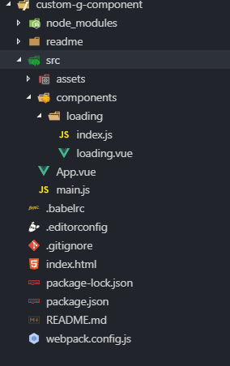

##Vue.use

### 问题
相信很多人在用Vue使用别人的组件时，会用到 `Vue.use()`。
例如：`Vue.use(VueRouter)、Vue.use(MintUI)`。
但是用 `axios`时，就不需要用 `Vue.use(axios)`，就能直接使用。

<!--more-->

### 答案
因为 `axios` 没有 `install`。
什么意思呢？接下来我们自定义一个需要 Vue.use() 的组件，也就是有 install 的组件，看完之后就明白了

建立一个简单的项目，项目结构如下：


在`src/components/loading`目录下建立两个文件，分别是`index.js`和`loading.vue`

`loading.vue`的代码如下
```javascript
<template>
  <div>
    Loading.........
  </div>
</template>

<script>
  export default {
    data() {
      return {

      }
    },
    components: {

    }
  }

</script>

<style>


</style>
```
`index.js`的代码：
```javascript
import LoadingComponent from "./loading"

const Loading = {
    // install 是默认的方法。当 use 这个组件的时候，就会调用本身的 install 方法，同时传一个 Vue 这个类的参数。
    // install 方法的第一个参数就是Vue
    install: function (Vue) {
        this.util.init()
        Vue.component('Loading', LoadingComponent)
        console.log('component register to gobla context......')
    },
    // 在这里面可以添加其它的逻辑
    util: {
        init:function name() {
            console.log('component init.........')
        }
    }
}
// 导出
export default Loading
```

### 使用
接下来在`main.js`中use该组件
```javascript
import Vue from 'vue'
import App from './App.vue'
import Loading from './components/loading/index'   // index可以不用写，默认加载index.js

// 全局注册组件  执行组件的install
Vue.use(Loading)

new Vue({
  el: '#app',
  render: h => h(App)
})
```
在Loading组件的install方法中我们已经使用`Vue.component`方法注册了组件
所以在App.vue中直接使用即可
```javascript
<template>
    <div>
        <h1>vue loading</h1>
        <Loading /> 
    </div>

</template>

<script>
//import Loading from './components/loading/loading.vue'
export default {
  name: 'app',
  data () {
    return {
      msg: 'Welcome to Your Vue.js App'
    }
  },
  // 局部注册组件
//   components:{
//       Loading
//   }
}
</script>

<style>

</style>

```
这样我们在Vue全局中注册了该组件，在vue的任何一个实例上可以直接使用


